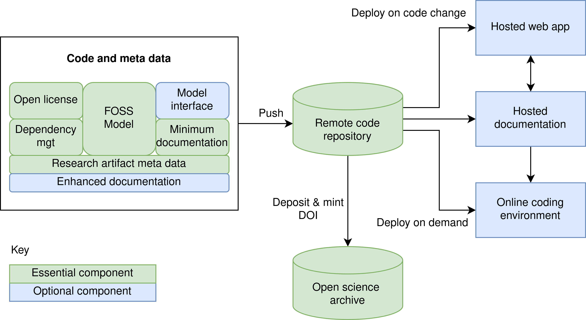

# 💫 STARS: Sharing Tools and Artefacts for Reusable Simulations

This organisation contains work relating to the STARS framework.

## STARS Framework

The STARS framework is a set of open practices, tools and learning materials to produce enhanced versions of research artefacts that intent to increase accessibility for others to (re)use, adapt and build on work.

Essential components of STARS framework (shaded in green below):
* Open license
* Dependency management
* Model created using free and open-source software (FOSS)
* Minimum documentation
* Research artefact meta data (ORCID ID + citation information)
* Remote code repository
* Open science archive

Optional components of STARS framework (shaded in blue below):
* Enhanced documentation
* Documentation hosting
* Online coding environment
* Model interface
* Web app hosting

## Repositories

The majority of repositories are related to our recent paper '[Towards sharing tools and artefacts for reusable simulations in healthcare](https://doi.org/10.1080/17477778.2024.2347882)', which includes three examples of the implemented STARS framework:

| Repositories | Description |
| --- | --- |
| [stars-treat-sim](https://github.com/pythonhealthdatascience/stars-treat-sim) | STARS paper example 1. Implements essential components + annotated notebook to run code executable online with Binder |
| [stars-simpy-example-docs](https://github.com/pythonhealthdatascience/stars-simpy-example-docs)  [stars-streamlit-example](https://github.com/pythonhealthdatascience/stars-streamlit-example) | STARS paper example 2. Fully implements essential + optional components including enhanced documentation hosted online and web app |
| [stars-ciw-example](https://github.com/pythonhealthdatascience/stars-ciw-example) | STARS paper example 3. Fully implements essential + optional components, but with different licence, documentation publishing software, web app framework and web app hosting |

Other repositories are:
| Repositories | Description |
| --- | --- |
| [stars-publications](https://github.com/pythonhealthdatascience/stars-publications) | List of all STARS publications |
| [stars-simpy-jupterlite](https://github.com/pythonhealthdatascience/stars-simpy-jupterlite) | JupyterLite template for SimPy models |
| [stars-stlite-example](https://github.com/pythonhealthdatascience/stars-stlite-example) | stlite template for SimPy models |
